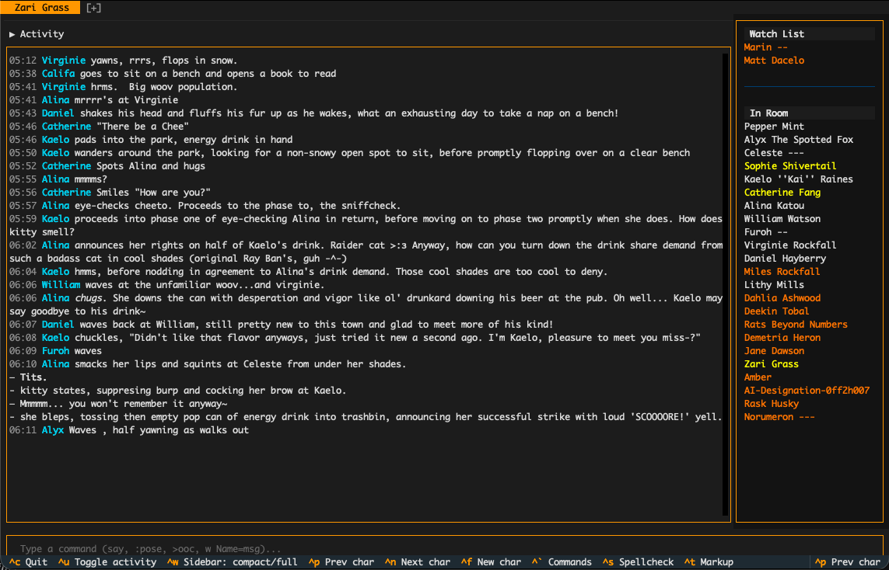

# yreflow

A console client for [Wolfery](https://wolfery.com), built with [Textual](https://textual.textualize.io/).

Wolfery is a text-based roleplaying platform. yreflow gives you a terminal UI for connecting to it -- character selection, room navigation, chat commands, spellcheck, and Wolfery markup preview.




## Install

Requires Python 3.11+.

```
uv tool install yreflow
```

Then run it:

```
yreflow
```

Or run it directly without installing:

```
uvx yreflow
```

## Usage

On first launch, yreflow shows a login screen. Enter your Wolfery username and password. After authentication, pick a character and you're in.

Type commands directly in the input bar. A few examples:

```
"Hello there!              # say something
:waves                     # pose an action
w Alice=Hey, over here     # whisper to someone
look                       # examine the room
go north                   # move through an exit
```

See [docs/COMMANDS.md](docs/COMMANDS.md) for the full command reference.

## Configuration

Settings are stored in `~/.config/yreflow/config.toml`. This file is created automatically on first login. See [docs/SECURITY.md](docs/SECURITY.md) for details on how credentials are handled.

## AI Disclosure

This project was developed with the assistance of [Claude Code](https://claude.ai/), Anthropic's AI programming tool.

## License

[MIT](LICENSE)
